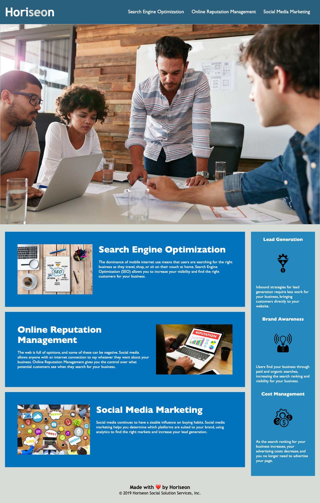

# Horiseon-main-page

## Description

This is the landing page of Horiseon, a company that specialised in online reputation and social media management.<br />
I was tasked with refactoring it to make sure it was compliant with the latest standards in regard to HTML semantics and accessibility, so that it's easily browsed by people with disabilities and also better positioned within a search engine's rankings. <br />
This is what I've done to reach those goals:<br />

- I have changed all the non - semantic elements to semantic ones where possible.
- I have refreshed the CSS code so that it interacts with the new writing of the HTML.
- I have made sure that the new website preserves the looks and functionality of the original page. 
- I have rearranged and streamlined the writing of the HTML and CSS files; the sections are now arranged in logical clusters to make sure that future developers can pickup and interpret the code more effortlessly.

As a developer, this job has taught me the symmetry between the writing of the HTML code and the CSS and their interdependencies; I've also consolidated my knowledge of the usage of classes or IDs and learned how to use tags I did not know beforehand, notably the <aria-label> one that I used to create an ALT text for an image referenced in the stylesheet.

## Installation

You can visit the page here at <a href="https://taichi-method.github.io/Horiseon-main-page" target="_blank">https://taichi-method.github.io/Horiseon-main-page </a>
## Usage

Provide instructions and examples for use. Include screenshots as needed.

To add a screenshot, create an `assets/images` folder in your repository and upload your screenshot to it. Then, using the relative filepath, add it to your README using the following syntax:

    ```md
    
    ```

## Credits

List your collaborators, if any, with links to their GitHub profiles.

If you used any third-party assets that require attribution, list the creators with links to their primary web presence in this section.

If you followed tutorials, include links to those here as well.

## License

The last section of a high-quality README file is the license. This lets other developers know what they can and cannot do with your project. If you need help choosing a license, refer to [https://choosealicense.com/](https://choosealicense.com/).

---

🏆 The previous sections are the bare minimum, and your project will ultimately determine the content of this document. You might also want to consider adding the following sections.

## Badges


Badges aren't necessary, per se, but they demonstrate street cred. Badges let other developers know that you know what you're doing. Check out the badges hosted by [shields.io](https://shields.io/). You may not understand what they all represent now, but you will in time.

## Features

If your project has a lot of features, list them here.

## How to Contribute

If you created an application or package and would like other developers to contribute it, you can include guidelines for how to do so. The [Contributor Covenant](https://www.contributor-covenant.org/) is an industry standard, but you can always write your own if you'd prefer.

## Tests

Go the extra mile and write tests for your application. Then provide examples on how to run them here.
